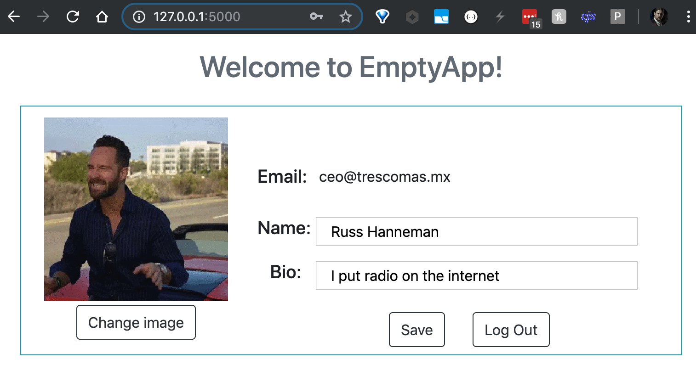

# Learn to use Algorithmia in a Fullstack Web Application

[Algorithmia](https://algorithmia.com/) provides a platform for running Machine Learning models as API Endpoints: you can create and upload your own models, or take advantage of over [9,000 ready-to-run models](https://algorithmia.com/algorithms).

This allows you to instantly and scalably incorporate machine learning into your own website, mobile app, or scripts.

In this repo, you can find a runnable fullstack web app, with a basic user registration and profile page, built on:

 - VueJS (frontend)
 - Python & Flask (backend / webserver)
 - MongoDB (NoSQL database)
 - Algorithmia (machine learning model hosting)

When the user uploads their profile picture, Algorithmia's [Nudity Detection](https://algorithmia.com/algorithms/sfw/NudityDetectioni2v) and [Content-Aware Resize](https://algorithmia.com/algorithms/media/ContentAwareResize) services are used to ensure that the image is safe-for-work, and to auto-crop the avatar without removing important features such as faces.  

Read the full writeup at [learn.algorithmia.com](https://learn.algorithmia.com/optional-building-a-fullstack-app-with-algorithmia), then clone this repo to try it out yourself: 

## Setup

1. Install [MongoDB](https://docs.mongodb.com/manual/installation/#mongodb-community-edition-installation-tutorials) 3 or 4 (on OSX with [homebrew](https://brew.sh/#install): `brew install mongodb`, and you may need to edit [start.sh](start.sh) to use `/usr/local/opt/mongodb@[VERSION]/bin/mongod`)
2. Install [Python](https://www.python.org/downloads/) (on OSX: `brew install python3`); this demo will run under python2.7 or python3
3. Run [install.sh](install.sh), *or* `pip install -r requirements.txt` to install all the packages in [requirements.txt](requirements.txt)
4. Add your [Algorithmia API Key](https://algorithmia.com/user#credentials) to the env: `export ALGORITHMIA_API_KEY='YOUR_API_KEY'`

## Run

1. Run [start.sh](start.sh), *or* manually start mongo (e.g. `mongod --dbpath ./mongodb --logpath ./mongodb/mongodb.log`) and Flask (e.g. `python app.py`)
2. Browse to [http://127.0.0.1:5000](http://127.0.0.1:5000/)

## Further learning

1. [Algorithmia Learning Center](https://learn.algorithmia.com/)
2. [Algorithmia Developer Center](http://developers.algorithmia.com)
3. [API Docs](http://docs.algorithmia.com/)
